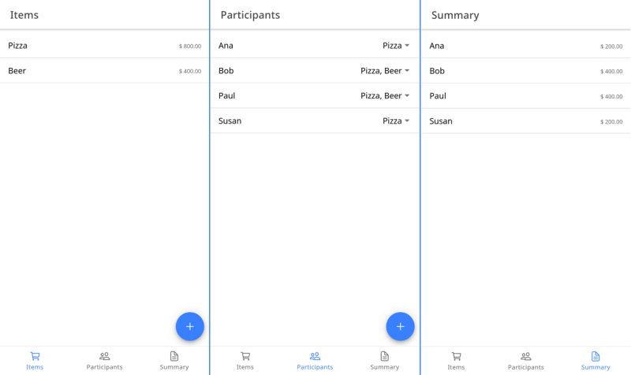

<p align="center">
    
<p>

# Billy

Split bills among friends, taking into consideration what each participant has consumed. Available in web versions and also as a PWA.

A live version is available on https://emlautarom1-billy.netlify.app/



## Requirements

- Node.js and npm

Tested on Fedora 36, Node 16.18.1 and npm 8.19.2.

## Build

```shell
$ npm install
$ npm run build
```

Resulting assets are stored in `www`. You can deploy those assets to any static site hosting service (ex. Netlify).

## Develop

Creates a local web on `http://localhost:4200/` with hot reload included.

```shell
$ npm start
```
